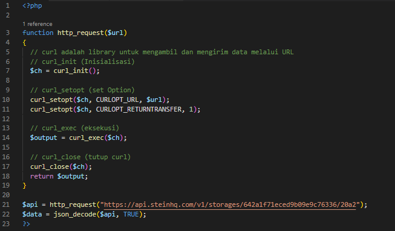
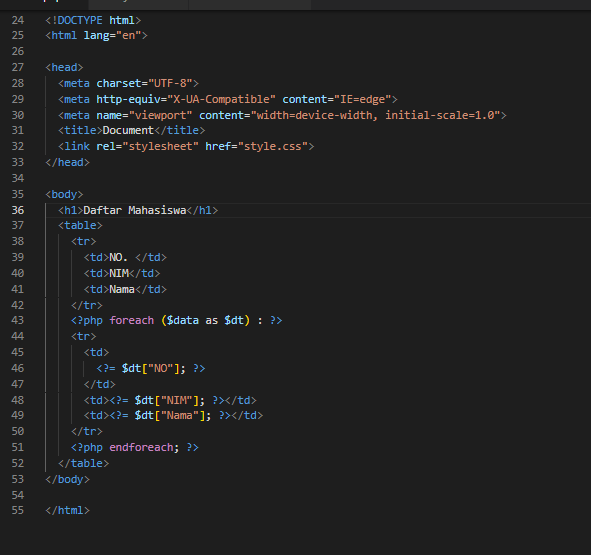
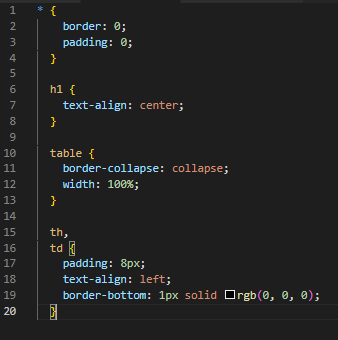
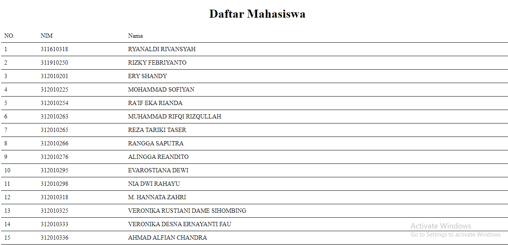
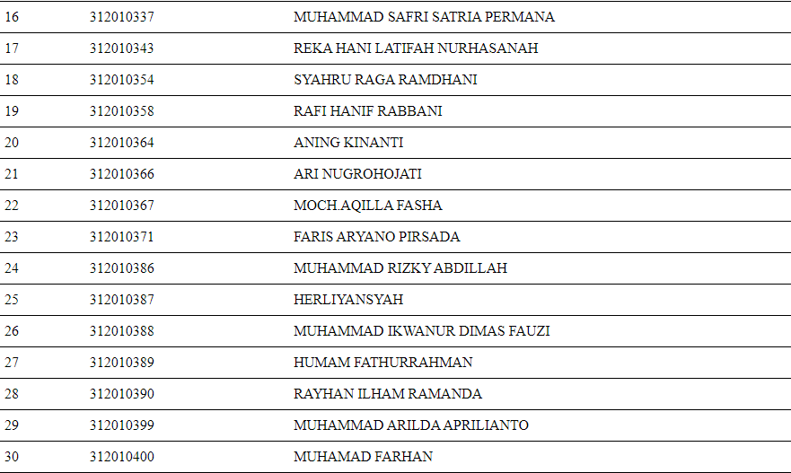
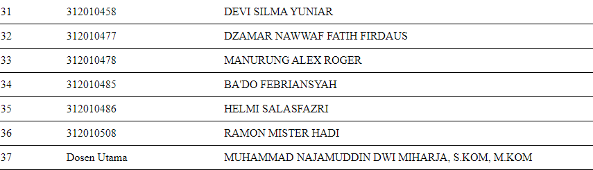

# Nama          : Moch. Aqilla Fasha
# NIM           : 312010367
# Kelas         : TI.20.A.2
# Mata Kuliah   : Pemrograman Mobile

## Tugas Pertemuan 4
### Menampilkan Data Mahasiswa kelas TI.20.A.2

1. Input

2. Output

